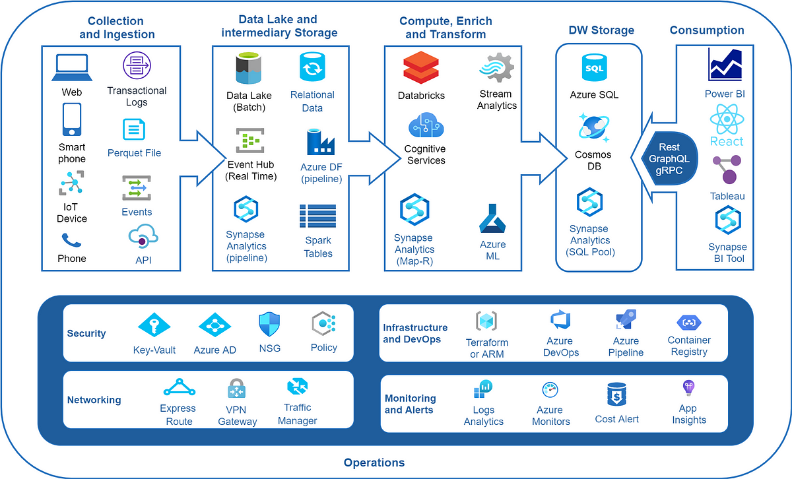

# Big Data Discovery Exercise

In this exercise we want you to work as a team to pull together a presentation on specific topics in **Big Data**.

The term **Big Data** relates to data that is too big to be stored on a single server.  Most big data systems can be ran as a single standalone system for learning, but in the real world the amount of data, in modern terms, is in excess of **Petabytes**.  For this to be sustainable and useable we need many computers to provide access to it.

Beyond **[Petabytes](https://www.idtech.com/blog/orders-of-magnitude-digital-data)**

* Exabyte - 10<sup>18</sup>
* Zettabyte - 10<sup>21</sup>
* Yottabyte - 10<sup>24</sup>

Systems such as;

* MongoDB
* HBase
* CouchDB
* RIAK
* DynamoDB

The choice of database is governed by the CAP theorem;

* C = Consistency
* A = Availability
* P = Partition tolerance

The choice is normally based on 2 of the above.

---


> CAP Theorem diagram

---

Agents run on the servers to perform actions requested by users.  These agents communicate with each other to gather the required data for queries so that it can be compiled into a valid dataset to be returned to the user quickly.

The splitting of data across servers and disks is known as **sharding** (a form of partitioning of the data, but across servers, rather than just disk).  This splitting of data also allows for speed of data insert as well as reading and the resilience of the data is performed by ensuring that we always have 1 server that can become redundant.

---


> Partitioning vs Sharding diagram

---


> Sharding in action

---

In the **Sharding diagram** we see that the **Tracking Table** is the virtual view of the data, but in reality that data is spread across different machines, and the agents on those systems will provide the complete view to the **requesting** agent.

There are many systems now available to store large amounts of data, starting with the Mother of all systems [Apache Hadoop](https://hadoop.apache.org).  All other systems came after.

Systems are now categorised into;

* Data Warehouse
* Data Lake
* Data Lakehouse

Increasing in size as we go down the list.

## A typical big data architecture

Large data systems require a structured architecture to manage disk and servers, and provide an interfaces to enable different data users to access the data in the way they need.

<center>


Azure Synapse Analytics Architecture Diagram

---


Spark Architecture Diagram

---


PySpark Architecture Diagram
</center>

## Making data quickly available

The engineering process of making data available, mean we need a product pipeline.  This automates our manual process.  So you might have been thinking that Python isn't for me, but we need to automate the process of;

* Cleaning
* Transforming
* Providing

To produce a data product that can be consumed by our clients;

* Business Analysts
* Data Scientists
* Developers

Data is now a commodity that can be sold.  The better our product the more people are prepared to pay.

To automate our product we create data pipelines;



Map reduce is one task that allows us to divide tasks and divide into smaller parallel tasks.  Map reduce example can be found [here](../DataEng/README.md).

An ETL process can be found [here](../DataEng/DataEngTask2-ETL.md).

# The task

You will divide into teams, and be given a subject area relating to big data to research and present back.

The subject areas are;

* Big data - speed and performance: the need for big data
    * In this topic you need to cover the 4 Vs, telling us what they are and how different databases handle these.
* Processing big data
    * Tools and platforms used to manage and work with big data
    * Who are the big players in the data services and what are their products
    * What tools allow us to interact with them
* Data pipelines, ETL and map reduce
* Data Warehouse
    * What is it, what systems are there to store the data, and what software can be used to work with the data
    * What are Data warehouses being used for.  Who is using them and what for?
* Data Lakes
    * What is it, what systems are there to store the data, and what software can be used to work with the data
    * What are Data Lakes being used for.  Who is using them and what for?
* Data Lake House
    * What is it, what systems are there to store the data, and what software can be used to work with the data
    * What are Data Lake houses being used for.  Who is using them and what for?

# Snowflake and Databricks

These are 2 cloud based services for storing big data.  Data is charged per usage normally per second, or per credits.

* Databricks
    * Pricing policy
        * https://www.databricks.com/product/pricing
        * Charged per second
    * Interface
        * Web based
        * SQL
        * Python notebooks
* Snowflake
    * Pricing policy
        * https://www.snowflake.com/en/pricing-options/
        * Charged by credits, which is per 1 minute of compute power.
    * Interface
        * Web based
        * SQL

# Databricks and big data exercsise

* Create a new free Databricks account.
    * https://www.databricks.com/
        * Select **Try Databricks**, button top right
    * Click **Continue with Express Setup**
    * Add your personal Email, and then go to your Email to complete the process
* Under the SQL section try out a SQL query
    * On the left of the query window you'll find the **Catalog**
        * There should be a **samples** folder with various sample databases
        * Try out a query on the **bakehouse**
            * You can see the tables by expanding **bakehouse**
            * Example

            ```
            SELECT * from samples.bakehouse.media_customer_reviews 
            ```
        * Try out some other SQL commands
        * See if you can create a JOIN

        The key thing to remember is that you're querying a database that is spread across multiple disks and servers.

* Click **New** button at the top left
    * Select **Notebook**
    * Import the bakehouse sales_customers

    ```python
    mydf = spark.sql("SELECT * FROM samples.bakehouse.sales_customers")
    ```

    You'll notice a slight different in the creation of a dataframe, through the use of the **spark** module.  Like Pandas, **spark** has an import mechanism for reading in data in many ways.  It is it's own API, but has similarities to Pandas.

    * Click on the dropdown arrow under the code frame and you'll see the dataframe described.
    * Show the top 5 rows

    ```python
    display(mydf.head(5))
    ```

    * Show only the columns of firstname, lastname and state

    ```python
    display(mydf.select("first_name","last_name","state"))
    ```

    * Show only those in Florida

    ```python
    FLOnly = mydf.filter(mydf.state == "Florida")
    display(FLOnly)
    ```

    * Look up how to do the following;
        * Group by **state** and **count** the number of people
        * HINT: df.groupby(...).count()
    * Sort the output by state
        * HING: df.sort(...)
    * Then sort descending
    * Find all the **distinct** states
    * Count how many males to females there are in the data set
    * Get the count of men per country and women per country
        * That is you should have a value for women in Japan and men in Japan, and for each country
    * Find out how to run a SQL statement to return a dataframe
    * Try using Seaborn and Matplotlib to show something interesting about the dataset

## Other useful spark methods

Here are some other examples of spark commands;

* Loading data to a file from a URL

    > NOTE: This requires access to the file system.  Databricks provides security to prevent access to files.

    ```python
    dbutils.fs.cp("https://tinyurl.com/tse-socks", "dbfs:/mysocks.csv")
    ```

* Reading from a CSV file on the server;

    ```python
    socksDF = spark.read.format("csv").option("header", "true").load("/mysocks.csv")
    ```

* Writing your dataframe to the file system;

    ```python
    socksDF.write.saveAsTable("mysocks")
    ```

* Embedded SQL in notebook

    ```sql
    %sql

    SELECT * FROM samples.bakehouse.sales_customers;
    ```