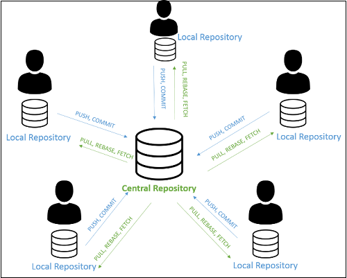
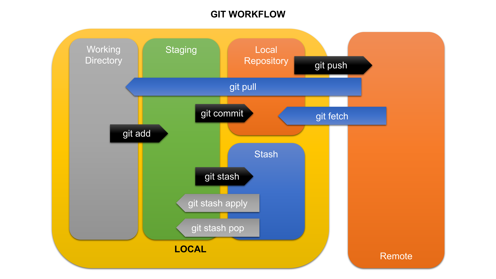
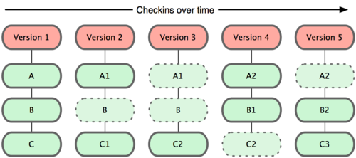

# Learn Git by doing

This folder gets you learning Git by actually doing it.

Ideally you want to do this with someone else, but you can do it by yourself if you need to, you just need to have multiple clones.  If you don't know what a **clone** is, don't worry you'll soon find out.

## First a bit about Git

A system designed to enable version control of your software project code, whilst working collaboratively as a team.  **VCS** is the name used for Version Control Systems, of which Git is one of them.

OK, you may get told by others, why don't we use Subversion (SVN), or CVS, or Perforce or some other source control management system.

Well Git is **distributed** and the others are not!

This means that as a developer you have your own copy of the entire version control repository on your machine once you have **cloned** (there's that word again.  I promise you'll find out soon) a repository, or created one yourself.  In a collaboration there is a central source.

In the diagram you can see that each developer has a local copy of the entire project and all the actions that have happened from the other developers.  This is possible because all developers must sync to a central **golden source**, called the **remote**.  The developers sync when they have changes that the rest of the team require, or are fit for release on the project.  These changes are generally controlled, and we'll discuss later.

Whilst working with git you will encounter the following workflows;

These areas we will cover during this course.  The workflow is left to right, but you'll notice a special **Stash**, which is out of context to the rest of the work, more later.

The most common of these that you will use in everyday work will be;
- push
- pull
- add
- commit

The others will vary depending on the complexity of the repository, number of members in the team and whether you are working on the same files.

**Git** is based on file snapshots, not delta's, as most other VCS are.  Below is an example;

- If a file has not changed when the snapshot is taken, Git stores a link to the previous snapshot.

## Important directories and files

Before we start it is important to know about some files Git will create.

- **$HOME/.gitconfig**
  - Global Git configuration settings
  - Includes email and name and other settings that should apply to all Git repository work.
- **.git**
  - Found at the top level of any Git repository
  - Contains all the essential history, settings and more
  - Deleting this directory will remove it from Git control on your local machine
  - You can view most of the files here with a text viewer.
- **.git/config**
  - The repository configuration, including the remote location and branches.
- **.git/hooks**
  - Scripts that are triggered by git commands
- **.gitignore**
  - Not created by default, but very important and useful, more later

Let's do some Git.

## Content

1. [Create a new repo](./01-New_Repo.md)
2. [Add some files and make history](./02-Make_History.md)
3. Working safely using branches
4. Merging your work into a single branch
5. [Viewing history](./05-View_History.md)
6. Creating and using a remote for backup
    - push and pull
7. Using an existing repository
    - branching
    - clone, push, pull
8. Working as a team
    - Clone a repository
    - Work on branches
    - Using pull requests
    - Bringing your local copy up to date
        - including your local branches
9. Merge conflicts
    - What are they
    - How to prevent them
    - How to reduce complexity
    - Why we told you to use branches
    - Why we told you to bring your branch up to date
    - Why we told you to use pull requests
10. How long is too long to resolve a conflict?
    - How to deal with it the quick way
11. Switching branches, but Git won't let me
    - What's all this stashing?
12. Rebase what?

## Fun online learning

Check out these online interactive Git intros;

- [https://gitmastery.me/](https://gitmastery.me/)
- [https://blimto.com/git/practice](https://blimto.com/git/practice)