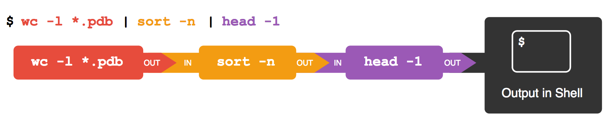

# Pipelines and Filters

Pipelines allow us to string the simple commands together to make more complex commands.

Commands pass their **standard output (stdout)** to the next commands **standard input (stdin)**.  The final command will then print to the screen unless the output is redirected.

The Linux philosophy for commands is;

> Commands do one thing and do it well

## Filter commands

Filter commands are those which accept input from **stdin**.  These can be identified by typing in the command without any arguments, and they will generally wait for you to type something in from the keyboard.

The following diagram shows the flow through a pipeline:



Courtesy of https://docs.ycrc.yale.edu/PIL/04-pipefilter/

For example we normally use the **cat** command to show the contents of a file by supplying the file name as an argument;

```sh
cat /etc/passwd
```

Of if we want to show the line numbers for each line of the file;

```sh
cat -n /etc/passwd
```

But what happens when you leave the file name off and just type **cat -n**?

If you're thinking your terminal has **crashed** it has **not**.  It is simply waiting for you to type something in, as **cat** is now waiting for **standard input** from the **keyboard**.  Go ahead and type something in and press enter.  Then do the same again, that is type something in and press enter.

You'll notice that each line you type in is printed, but with the line number preceding it.

Example;

```sh
cat -n
Hello
    1  Hello
Oh no
    2  Oh no
^D
```

The last character **^D** is the pressing of **CTRL** key and **D** together.  **CTRL+D** sends the end of input to the **cat** command.  Careful that you only do this once, otherwise you will be logged out of the terminal.

Any command that waits for **stdin** can be used as a filter command.  A list of commands that can be used as filters;

* cat
    * Show the contents of files without a break, or pagination
* head
    * Show a number of lines from the beginning of input/file
    * Examples
        * ```head /etc/passwd```
            * Show first 10 lines form /etc/passwd file
        * ```ls -l /usr/bin | head -5```
            * Show first 5 lines of the output of **ls -l /usr/sbin**
* tail
    * Show a number of lines from the end of the input/file
    * Examples
        * ```sudo tail /var/log/messages```
            * Show the last 10 lines of the system log file.  Sudo is required as the file is viewable only by root, normally.
        * ```ls -l /etc | tail -5```
            * Show the last 5 lines of the output of the **ls -l /etc** command.
        * ```sudo tail -f /var/log/messages```
            * Show the last 10 lines of the log file, but keep the file open so we can see new entries until we press CTRL+C.  This is known as **concurrent** or **follow** mode.
* sort
    * Sort the input alphanumerically, numerically
    * Can sort ascending or descending, and specify which columns to sort by
    * Examples
        * ```ls -l /etc | sort -k5nr```
            * Sort the **ls** output by the file size (column 5) in descending (reverse) order.
        * ```ls -l /etc | awk '{print $5}' | sort -n | wc -l```
            * Grab the 5th column from the **ls -l** command and sort it numerically in ascending order and print the number of lines
* uniq
    * Can only be used if all common items are adjacent
    * Sort must be used before this command in a pipeline
    * Examples
        * ```ls -l /etc | awk '{print $5}' | sort -n | uniq | wc -l```
            * As above, but this time counting only all numbers once, so no duplicates
        * ```ls -l /etc | awk '{print $5}' | sort -n | uniq -d | wc -l```
            * As above, but counting the number of numbers that are duplicated
* wc
    * Word count, can count **lines**, **words** or **characters**
    * ```ls -l /etc | grep '^d' | wc -l```
        * Using a long listing of the /etc directory grab the lines that start with the letter **d** (for directory in the output of ls -l) and count the number of lines.  So counting the number of visible directories in /etc.
* grep
    * Search for text in files or input streams
    * Has a set of metacharacters to allow matching of patterns of text where characters may vary
        * Example ```'p..p[abeiou]*l.*'``` would match;
            * people
            * paypal
            * palpable
            * palpability
            * palpably
            * penpal
            * pimply
* sed*
    * A non-interactive text editor
    * Can replace text in a file if **-i** option is used (not on a Mac though)
    * By default modified text is sent to **stdout**
    * See [Sed Command in Linux/Unix With Examples](https://www.geeksforgeeks.org/linux-unix/sed-command-in-linux-unix-with-examples/) for a tutorial, and further detail
* awk
    * Is a full programming language for text manipulation, with it's syntax based on C
    * A quick introduction [AWK command in Unix/Linux with examples](https://www.geeksforgeeks.org/linux-unix/awk-command-unixlinux-examples/)
    * A more detailed introduction at https://www.tecmint.com/category/awk-command/
* fmt
    * Format text output
* pr
    * More detailed than fmt, allowing speficiation of columns and size and page devision
    * Used to be used to prepare text for a printer
* tr
    * Transpose text
    * This command can only be used with **stdin**, it does not take files or directories as an argument
    * Example
        * ```echo "hello world" | tr '[a-z]' '[A-Z]'```
            * Transposes all lowercase letters to uppercase letters
* cut
    * Can cut out and keep the specified characters or columns
    * Awk does columns better than **cut**

Some useful references;

* Quick and simple
    * https://ryanstutorials.net/linuxtutorial/filters.php
    * https://docs.ycrc.yale.edu/PIL/04-pipefilter/
* Other filter tutorials
    * https://www.tecmint.com/linux-file-operations-commands/
        * Has further links for more details learning
    * https://labex.io/tutorials/linux-how-to-filter-files-in-linux-command-line-425780
* Finding files and filtering files with **find** and **grep**
    https://medium.com/itversity/filtering-files-and-folders-in-linux-file-system-using-piping-pattern-matching-find-grep-etc-f7053f507cb3