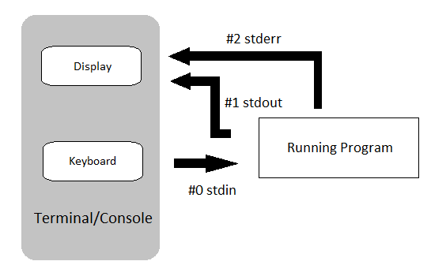

# Redirection, Pipes and Filters

This is one of the most common areas that all users of Linux should know.  These commands and actions allow us to store information for later use in a file or disregard information completely whilst running commands, or to pass information between commands to reduce the amount of noise and provide the relevant information to identify problems with applications, or simply getting the data we need.

# Redirection

Redirection is used when we need to capture information from a command for later use, or to create log files from an application that prints information to standard output or standard error.  We can also use redirection to feed data in to commands, especially those that do not allow for files to be passed as arguments, such as **tr**.

Every process in Linux is given 3 **file descriptors** (also called file handles, channels or streams) which allow the process to either receive input or send output or errors to a specific location.

The default set up for these **file descriptors** are shown below;



We can see that by default **standard input** shown as **#0 stdin**, file descriptor zero comes from the **keyboard**.  The process has 2 output descriptors, that by default go to the terminal screen;

* **#1 stdout**, called standard output, which is where all good and valid information comes through from the process/application.
* **#2 stderr**, called standard error, is where the process will send any issues or errors that the command needs to communicate.

## Saving for later

Imagine that it's 4:45pm, and your boss has just asked if you can kick off the compilation of the whole project.  You know it's going to take at least an hour and a half to complete, but you are not sure that it will succeed or fail, and if it fails you want to know where.  You've been told you can finish at 5pm, but you need to pick up any errors in the morning and re-run if there are.

Let's say the command to compile is;

```
g++ project.cpp
```

Normally we'd let that run and come back after lunch or a coffee, but we're going to be away longer than normal, so want to capture the output as though we were watching.

We could just capture the good output;

```sh
g++ project.cpp >good_output
```

As an example you could run now do;

```sh
cd
ls -lR / >good_output
```

* Where do the errors go, and where is the output?
* Would this be of any use to us in capturing how the compilation played out if there were errors?

An animation of the above is in PPT form [](videos/redirect2.mkv)

What about;

```sh
g++ project.cpp 2>bad_output
```

What happens now, and what is going where?

To try out this, run the following command;

```sh
ls -lR / 2>bad_output
```

* Where does the output go, and where are the errors?

We really need to use a combination of both, redirecting stdout and stderr, so we could try something like;

```sh
g++ project.cpp >good_output 2>bad_output
```

Now, this could work, but what's the issue here?

* Do I get the output as it would happen, just like sitting in front of the screen and watching it live?
* What is going where?
* Does the output contain any timestamps?
    * If it did then what issues would we have now?

You can try this with the the command we've been using;

```sh
ls -lR / >good_output 2>bad_output
```

With this command we might possibly be able to stitch together when the errors occurred based on the file or directory names.  **But** this does mean more work for us.

You might now be thinking, why didn't you just redirect to both files?

```sh
g++ project.cpp >compile_log 2>compile_log
```

This might look right, but are they combined or independent pointers to the same file?

In **bash** you might find that you're lucky as they coded the above to do what we want it to do, but we could still potentially lose data.  The redirection in most shells will set up 2 independent writers to the file meaning we could overwrite data.

The correct method is to merge the file descriptors.

```sh
g++ project.cpp >compile_log 2>&1
```

In the above we set up where we want our output to go first using **stdout**.  In this case we set it to output to **compile.log**.  Then we tell it to merge **stderr** with **stdout** through the use of **>&**.  Either side of this symbol we specify which file description will be attached to main.  In this case we wish to **merge** stderr **into** stdout.

**YOUR TURN**

We could also have written the command differently, by redirecting **stderr** first.  What would that look like?

