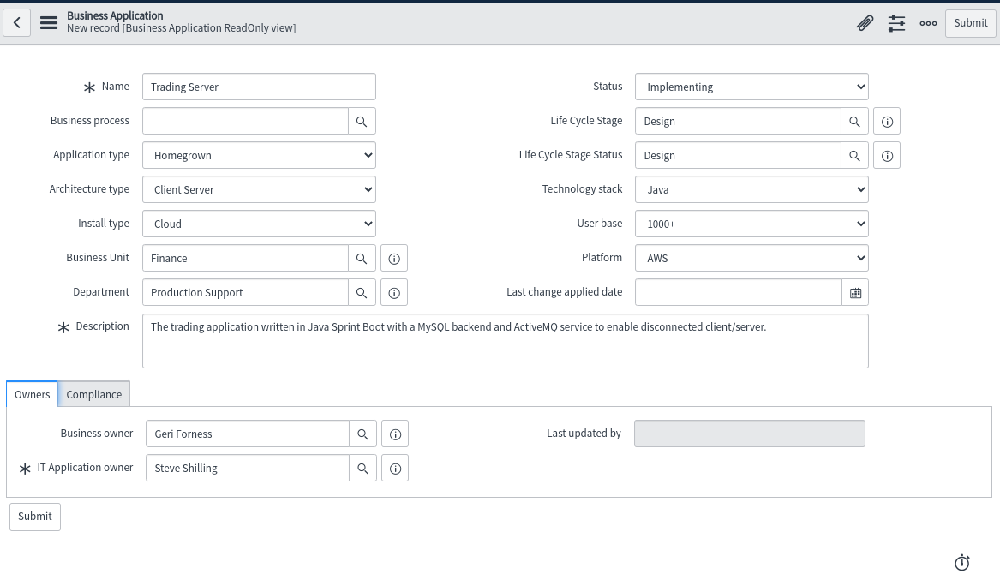
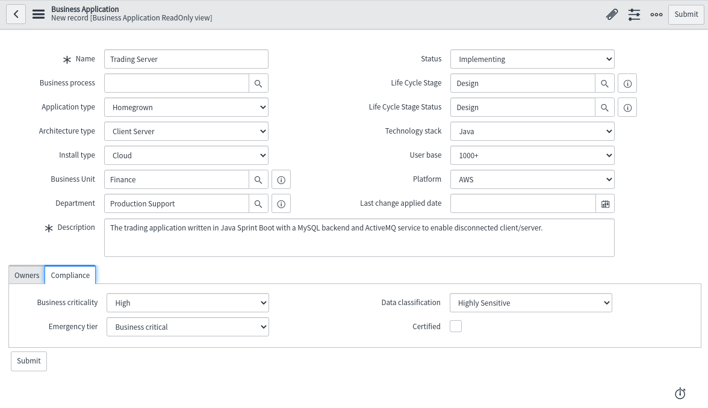
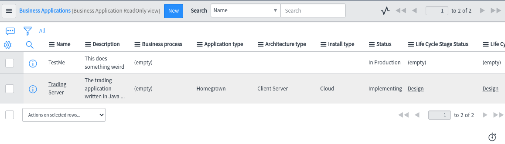

# Creating a Business Application

In this section we will look at adding an application for association with Incidents, Problems and Knowledge articles.

## Adding the application

From the left menu click on **Business Applications**.

When you launched your instance, especially in Rome you would have been asked for an Application, which you may see here.

If you do not see an application simply click the **New** button and fill in the form, an example shown below.

Then clicking the **Compliance** tab at the bottom.

Then on submit you'll be shown the list of applications.

