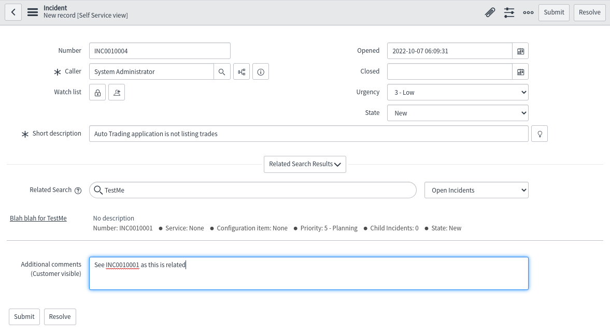

# Incident Management

Once you have a business application to support you can then start to use Incident management and other features and link your application to them.

Table of Contents
- [Incident Management](#incident-management)
  - [Creating an Incident](#creating-an-incident)
  - [Updating Incidents](#updating-incidents)
    - [Changing the status](#changing-the-status)
  - [Completing the Incident](#completing-the-incident)

## Creating an Incident

From the left navigation menu under **Self-Service** you should see **Incidents**.  If you cannot see it then type **Incidents** into the **Filter navigator** text box and click on **Incidents** under **Self-Service**.

A new incident can be created as follows:

* Click the **New** button at the top of the main area.
* You will receive a new **INC** number.
* The **Caller** will be set to you the logged in user.  You could always select a different user to make it more interesting.
* Change the **Urgency** to the incident you are implementing.
* In the **Short description** type in a short note on what your incident is, e.g. *Auto Trading application is not listing trades*.
  * As you start to type in a description you might start seeing information showing up under **Related Search**.  These are potential issues that may or may not match your issue
* The **Related Search** allows you to look for Knowledge articles or other issues.
  * Clicking on the links opens documentation about the issue to help fix the issue - see **Knowledge and Catalog** to see how you can add documentation for this page.
  * Clicking on the pull down at the end of the **Related search** text box you can see different information, e.g. Outages, or Open Incidents.

An example incident before submitting:

* Click **Submit** to save the incident.

**NOTE**: The search will not be saved as part of the incident, so you should reference documentation, etc in the additional information section.

## Updating Incidents

A typical incident will have many additional notes added to it during it's life.  These would include things such as:

* Getting further information from the person who raised the ticket.
* Adding references to other incidents, problems, etc.
* Adding commands, actions, checks, etc that have been used to indentify the cause to the additional information/comments
* Adding the solution, which will consist of information and commands ran.

Each time you add something to the **Additional comments** you will need to **Post** the comment using the **Post** button.

### Changing the status

When the incident is created the **State** is set to **New**.

When someone starts work on it, they should change the **State** to **In progress** and click the **Update** button at the bottom of the screen.

If something else prevents working on the ticket, e.g. you need Network or Platform or another team to do some work on another ticket then you would place it into **On Hold**.  This requires you to choose an **On hold reason** before clicking **Update**.

If the issue is resolved by another ticket, then the incident may be set to **Closed** or **Cancelled** with information being added by you to the comments section as to why.

To complete the incident once the documentation is up dated then you would click **Resolve**, but before clicking you must make sure your comments show all that has happened and the fix.

## Completing the Incident

After posting the necessary comments that tell us how the incident was solved you will need to **Resolve** it.

Clicking the **Resolve** button would be the same as changing the **State** to Resolved and clicking **Update**.

To fully complete an incident the **State** should be closed.  The process of closing an incident is generally performed after one of the following:

* A higher level colleague checking the ticket for completeness, or someone who's role it is to check tickets that are marked resolved.
* A postmortem has occurred to which this ticket is part of, and the postmortem committee is satisfied that the issue is resolved.

To close the ticket you will go to the ticket detail, change the **State** to **Closed** and then click **Update**.