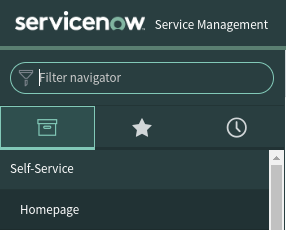
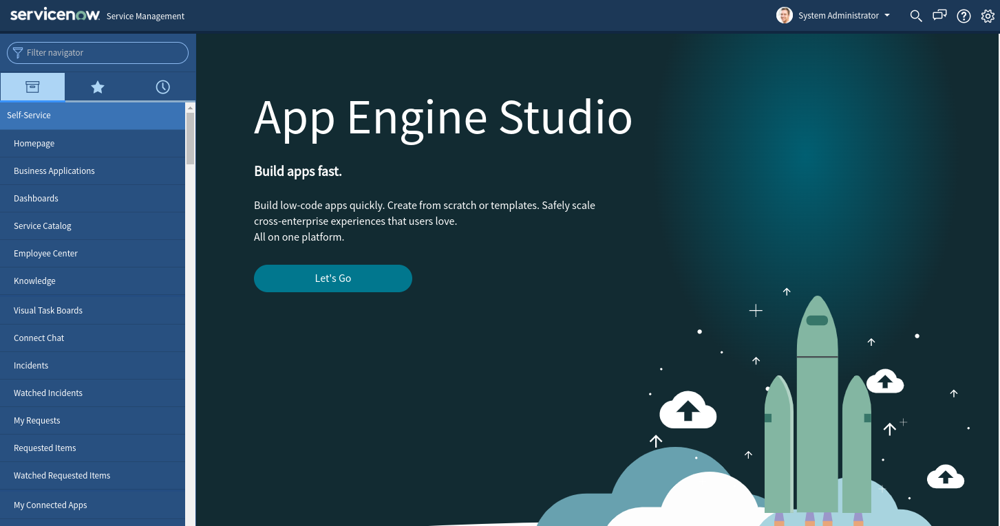
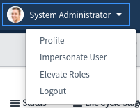
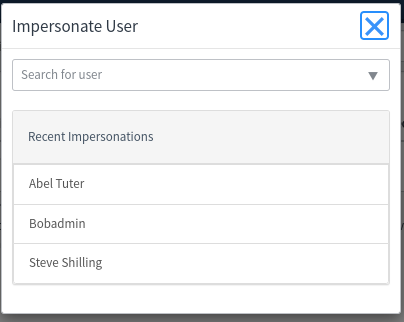
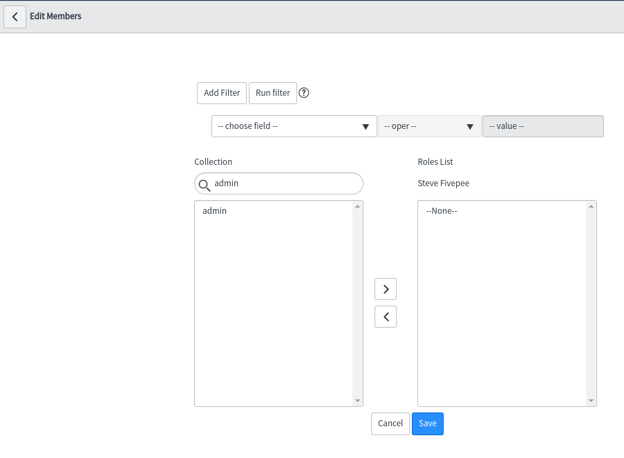

# Using Service Now PDI

Table of content
- [Using Service Now PDI](#using-service-now-pdi)
  - [Creating a PDI](#creating-a-pdi)
    - [Didn't make a note of the instance details?](#didnt-make-a-note-of-the-instance-details)
  - [The View of ServiceNow](#the-view-of-servicenow)
  - [Working with Users](#working-with-users)
    - [Adding Users](#adding-users)
- [The rest of the documentation](#the-rest-of-the-documentation)

## Creating a PDI

Here you will create a PDI to practice using ServiceNow.

Point your web browser at [Service Now Personal Developer Instance](https://developer.servicenow.com/dev.do)

1. Create yourself an account on Service Now using your own personal details (not your companies).
2. Log in as that user
3. Click on the **Request Instance**
4. Select the location nearest to your country
   e.g. Rome for Europe, Tokyo for APAC
5. Wait for your instance to become ready
6. Make a note of the URL for your instance, the username and the password as you'll need these to log on with.
   The user is normally **admin**

**NOTE** when you log in to your instance do not click the **Let's go** button as you don't want the Studio, you need the **Service Management** view.

You could also follow the instructions on the ServiceNow website [https://developer.servicenow.com/dev.do#!/learn/learning-plans/rome/new_to_servicenow/app_store_learnv2_buildmyfirstapp_rome_personal_developer_instances](https://developer.servicenow.com/dev.do#!/learn/learning-plans/rome/new_to_servicenow/app_store_learnv2_buildmyfirstapp_rome_personal_developer_instances)

### Didn't make a note of the instance details?

Not a problem, just log back on to ServiceNow using the above URL and click the **Start building [dev******]** button.  This will take you straight to your instance.

You can change your **admin** password as follows:

1. 
2. In the **Filter navigator** type in **Users**
3. Under **Organization** click **Users**
4. At the top of the main view you'll see a **Search** with **Name** selected and a text box 
5. Change the pull down from **Name** to **User ID**
6. Type **admin** into the search text box
7. Click **admin** in the list
8. In the **Password** text box type in your new password.

## The View of ServiceNow

Once you have started your PDI you should see the following screen:

**NOTE** Do **NOT** click the Let's go button.

If you've selected Tokyo, you might not see the left hand menu by default, but instead you will have a menu at the top left of the screen, of which you will have the word **All**.  Click this and the menu will appear, and then click the **Pin** icon to the right of the **filter** text box.

## Working with Users

Once you have a ServiceNow PDI, you can add other users to your instance.  ServiceNow does provide some users already that you can **Impersonate** by clicking on the **System Administrator** icon at the top of the main screen:

You can then select **Impersonate User**:

You can type into the **Search for user** or click the pull down and select the user, or you can click on **Recent Impersonations** if you have already selected some previously.

### Adding Users

You can add user accounts to your PDI as follows:

* In the **Filter navigator** type in **User**
* Scroll down the menu to **Organization**
* Click **Users**

  
* Click on the **New** button at the top of the main area.
* The minimum field requirements
  * User ID
    * This is the login name
  * Password
* Other fields
  * You might want to add the First and Last names to make it easier to identify who is who, and the time zone
* Click the **Submit** button to create

You now need to give the user a role.  For simplicity let's give all our users **admin** which will allow them to do and see almost anything.  To do this:

* From the user list, locate the **Search** section at the top of the main area.
* From the pull down select **User ID** or **Name** depending on which you know to search (User ID being the log in name).
* In the **Search** text box type the **User ID** or **Name** that you just created based on your pull down option.
* Click the **User ID** that you just created
* Scroll to the bottom of the screen and click the **Roles** tab
* Click the **Edit** button
* Under **Collections** in the text box type in **admin**.  This will show something similar to

  
* Click on **admin** in the **Collections** box to select it
* Then click the **>** button to add it to the **Roles List** box on the right.
* Click **Save** to update the users roles.  This will add further roles to the user.

Your user can now log in and use the system.  You'll need to give them the URL to your PDI instance, and then tell them their **User ID** and **password** for that user.

# The rest of the documentation

Listed below are further guides to help work with the basics of service now.

* [Creating A Business Application](CreatingABusinessApplication.md)
* [Incident Management](IncidentManagement.md)
* [Knowldege Articles](Knowledge.md)